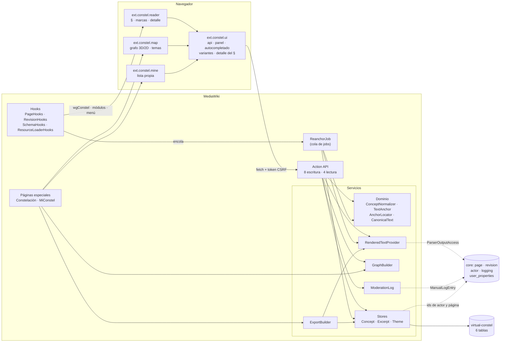
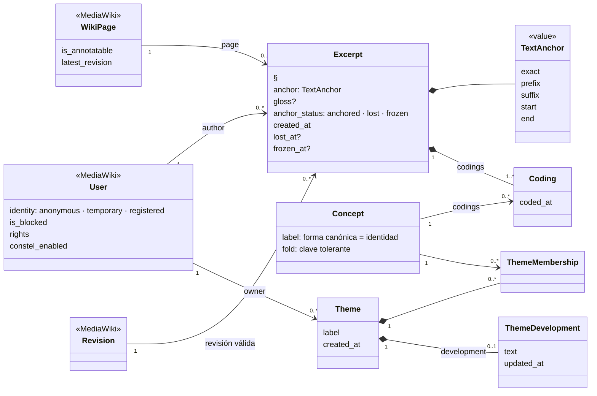
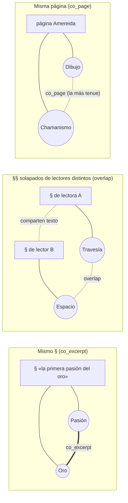
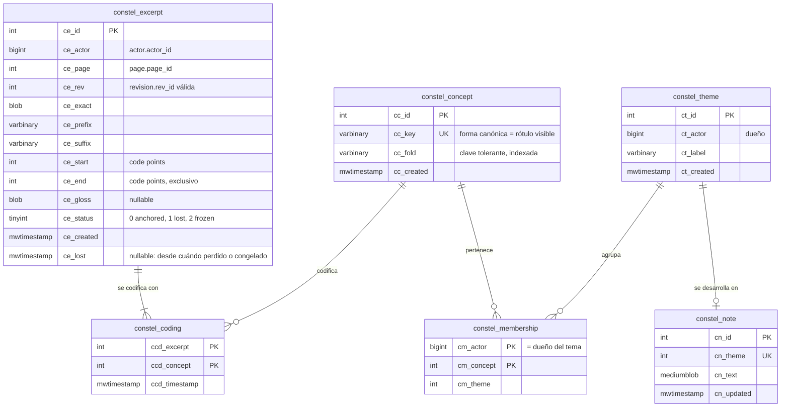
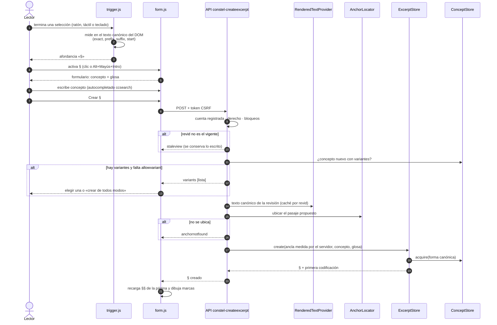
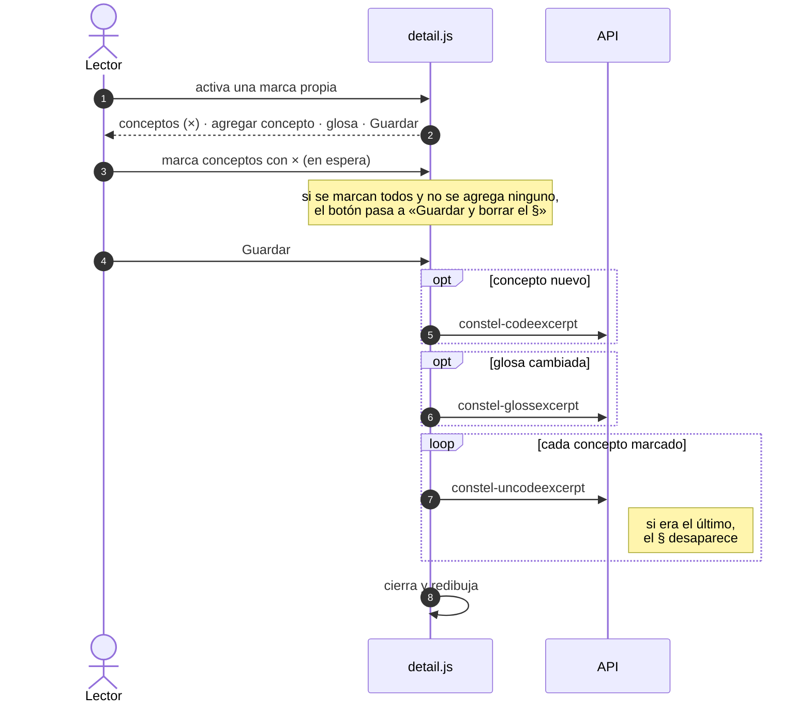
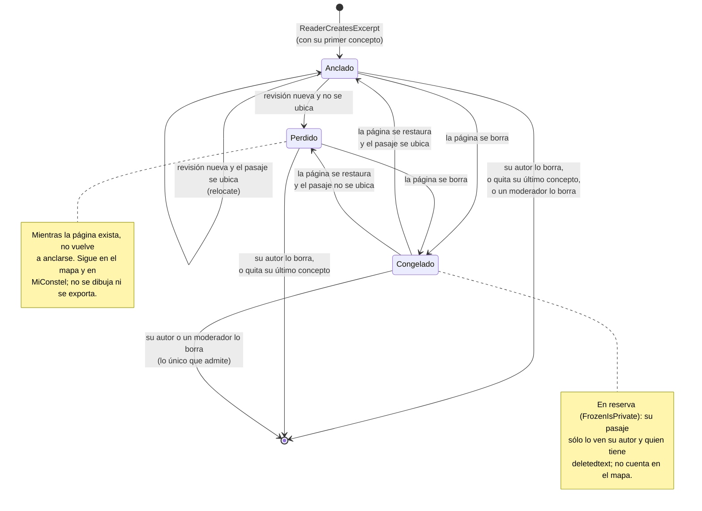
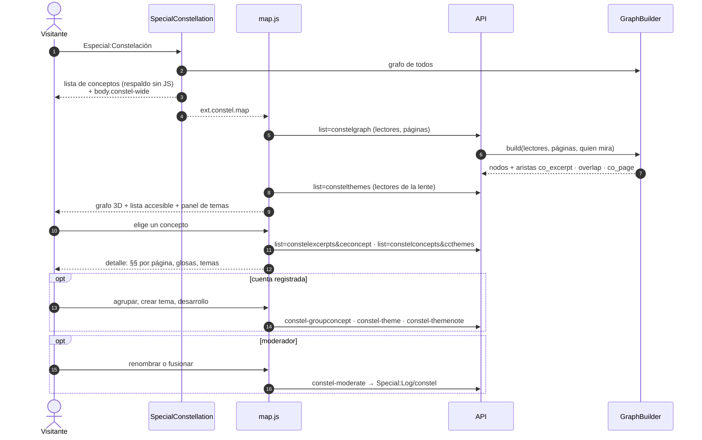

# Casiopea-Con§tel — arquitectura

Cómo se construye la extensión. El **qué** (comportamiento observable) está en
[`specs/casiopea-constel.allium`](../specs/casiopea-constel.allium), que es la
fuente de verdad. Este documento cubre el **cómo** y los detalles que el spec
deja fuera a propósito: esquema, API, módulos, algoritmos y diseño visual.

Versión documentada: **0.3.0**.

## Contenido

1. [Doctrina](#doctrina)
2. [Visión general](#visión-general)
3. [Modelo de entidades](#modelo-de-entidades)
4. [Modelo de datos](#modelo-de-datos)
5. [Modelo de interacción](#modelo-de-interacción)
6. [Conceptos](#conceptos)
7. [Anclaje](#anclaje)
8. [Lectura en la página](#lectura-en-la-página)
9. [Mapa y páginas especiales](#mapa-y-páginas-especiales)
10. [API](#api)
11. [Moderación](#moderación)
12. [Diseño](#diseño)
13. [Calidad y tests](#calidad-y-tests)
14. [Privacidad](#privacidad)
15. [Estructura del repo](#estructura-del-repo)
16. [Hitos](#hitos)

## Doctrina

- **Spec primero.** Un cambio de comportamiento actualiza el `.allium` en el
  mismo commit. `allium check` y `allium analyse` quedan limpios.
- **Todo declarativo.** `extension.json` (manifest v2) registra hooks, API,
  páginas especiales, módulos de ResourceLoader, jobs, registro, derechos,
  grants, preferencias por defecto, mensajes, config, autoload PSR-4 y el
  dominio virtual de BBDD. En `LocalSettings.php` solo va `wfLoadExtension` y
  los overrides de config.
- **Servicios inyectados.** La lógica vive en servicios
  (`ServiceWiringFiles`). Los hooks, la API, los jobs y las páginas especiales
  los reciben por constructor (`services` en el manifest). Nada de
  `MediaWikiServices::getInstance()` fuera del wiring.
- **El servidor es la autoridad.** El cliente propone; la API valida
  identidad, derechos, bloqueos, largos, pertenencia y revisión vigente, y
  vuelve a medir el pasaje por su cuenta.
- **No tocar el contenido.** Anotar no crea revisiones ni invalida la
  ParserCache. Los §§ se pintan en el cliente sobre el DOM ya renderizado, y
  desinstalar la extensión no rompe ninguna página.
- **Agnóstica de skin; diseñada para Stella Nova.** Ver [Diseño](#diseño).

**Terminología.** En la interfaz, un § se llama **sección** (decisión del
2026-09-22; «pasaje» quedó en desuso). En el código, la API y el spec
conserva su nombre técnico, `excerpt` / `Excerpt`, como en constel. En este
documento «§» y «sección» son lo mismo.

**Nombre y slug.** El nombre es `Casiopea-Con§tel` (`name` en
`extension.json`, lo que muestra `Special:Version`). El slug es
`casiopea-constel`: carpeta, `wfLoadExtension( 'casiopea-constel' )`,
`remoteExtPath`, clave de `MessagesDirs` y prefijo de mensajes
(`casiopea-constel-desc`). El espacio de nombres PHP es
`MediaWiki\Extension\CasiopeaConstel\`, y los servicios usan el prefijo
`CasiopeaConstel.`, porque un identificador PHP no admite `-` ni `§`.

## Visión general

Tres superficies de uso (la página que se lee, el mapa y la lista propia)
sobre una misma API. La API delega en servicios de dominio y en stores, que
son los únicos que tocan el dominio de BBDD `virtual-constel`. Los hooks
enganchan la extensión al ciclo de vida de MediaWiki sin tocar el contenido.



## Modelo de entidades

Las entidades del spec y cómo se relacionan. `User`, `WikiPage` y `Revision`
son de MediaWiki; el resto es de con§tel. El modelo es **fiel a constel**: el
§ se relaciona N:M con conceptos a través de la codificación, los conceptos
son globales, y los temas y su desarrollo son de cada lector.



Reglas que el diagrama no alcanza a mostrar:

- **Un § nace codificado y muere al perder su último concepto**
  (`ExcerptsAreCoded`, `UncodedExcerptVanishes`).
- **Un concepto existe mientras algún § lo use** (`UnusedConceptVanishes`);
  al desaparecer se llevan sus pertenencias a temas.
- **Un concepto está en a lo sumo un tema de cada lector**
  (`OneThemePerConceptPerReader`); lectores distintos lo agrupan distinto.
- **Un § anclado apunta a la revisión vigente** (`AnchoredMeansCurrent`),
  de forma eventual: se cumple cuando corre el re-anclaje.

El mapa deriva sus aristas de estas entidades, sin guardarlas:



## Modelo de datos

Las seis tablas viven en el **dominio virtual** `virtual-constel`
(`DatabaseVirtualDomains`). Por defecto usan la BBDD de la wiki, y
`$wgVirtualDomainsMapping` permite moverlas a otra sin tocar código. El
acceso pasa por `IConnectionProvider::getPrimaryDatabase( 'virtual-constel' )`
y `getReplicaDatabase( 'virtual-constel' )`.

Las referencias al core son **ids** (`actor_id`, `page_id`, `rev_id`), sin
claves foráneas SQL: así las tablas pueden vivir en otra BBDD. Los autores se
guardan como actor (sobrevive a renombres de usuario) y las páginas por id
(sobrevive a traslados). Los timestamps son `binary(14)` de MediaWiki.



| Tabla | Entidad | Índices |
|---|---|---|
| `constel_concept` | Concept | único `cc_key`; `cc_fold` |
| `constel_excerpt` | Excerpt | (`ce_page`, `ce_status`); (`ce_actor`, `ce_created`) |
| `constel_coding` | Coding | PK (`ccd_excerpt`, `ccd_concept`); `ccd_concept` |
| `constel_theme` | Theme | `ct_actor` |
| `constel_membership` | ThemeMembership | PK (`cm_actor`, `cm_concept`); `cm_theme`; `cm_concept` |
| `constel_note` | ThemeDevelopment | único `cn_theme` (uno por tema; 0.4.0 funde las notas previas) |

`cm_actor` repite el dueño del tema para que la unicidad «un tema por concepto
y por lector» la garantice la clave primaria.

**Cascadas.** Las reglas del spec se aplican en la misma transacción que la
escritura que las provoca, dentro de los stores, no con triggers SQL:
descodificar el último concepto borra el §, y un concepto sin codificaciones
se borra con sus pertenencias. Las escrituras evitan `UPDATE IGNORE` (no es
portable a Postgres): primero borran lo que chocaría, después actualizan.

**Esquema y cambios.** El esquema se escribe en formato abstracto
(`sql/tables.json`); el SQL de MySQL, SQLite y Postgres se genera con
`generateSchemaSql.php`. Cada cambio posterior va como cambio abstracto en
`sql/abstractSchemaChanges/` (SQL por motor con `generateSchemaChangeSql.php`),
y `SchemaHooks` lo aplica en el dominio virtual con `update.php`. El primero es
`ce_gloss`.

**Fuera de estas tablas:** las preferencias `constel-enabled` y
`constel-public-ack` (en `user_properties` del core) y el registro de
moderación (en `logging`, tipo `constel`).

## Modelo de interacción

### Crear un §

El cliente mide sobre su DOM y propone. El servidor comprueba la revisión,
vuelve a medir sobre su propio texto canónico y guarda **su** medición.



### Editar un § propio (un solo «Guardar»)

El panel acumula los cambios y los aplica en orden, para que quitar todos los
conceptos y agregar uno nuevo no borre el §.



### Re-anclaje cuando la página cambia

```mermaid
sequenceDiagram
    autonumber
    actor E as Editor
    participant MW as MediaWiki
    participant H as RevisionHooks
    participant Q as Cola de jobs
    participant J as ReanchorJob
    participant P as RenderedTextProvider
    participant Loc as AnchorLocator
    participant S as ExcerptStore

    E->>MW: guarda una revisión
    MW->>H: PageSaveComplete
    alt edición nula o página sin §§ anclados
        H-->>MW: nada
    else
        H->>Q: lazyPush(ReanchorJob, deduplicado por página)
    end
    Note over Q,J: más tarde, fuera de la request
    Q->>J: run()
    J->>MW: revisión vigente AL CORRER
    J->>P: su texto canónico
    loop cada § anclado a una revisión anterior, y cada § congelado
        J->>Loc: locate(ancla, texto)
        alt se ubica sin ambigüedad
            J->>S: relocate(nueva revisión, ancla recalculada; queda anclado)
        else no se ubica o es ambiguo
            J->>S: markLost
        end
    end

    E->>MW: borra la página
    MW->>H: PageDeleteComplete
    H->>S: freezeForPage (en el acto)

    E->>MW: restaura la página
    MW->>H: PageUndeleteComplete
    H->>S: adoptFrozen(page_id originales → página vigente)
    H->>Q: lazyPush(ReanchorJob)
```

### Ciclo de vida de un §



### Leer el mapa



## Conceptos

La identidad de un concepto es **estricta, como la de un título de
MediaWiki** (decisión del 2026-09-22): «Diseño» y «Diseno» son conceptos
distintos. `ConceptNormalizer::canonical` produce la forma canónica, que es la
clave y el rótulo visible:

1. Normalización Unicode NFC.
2. `_` pasa a espacio; se hace trim y los espacios internos se colapsan a uno.
3. La primera letra va en mayúscula si `$wgCapitalLinks` está activo (como en
   los títulos del namespace principal). El resto queda **exacto**:
   mayúsculas, tildes, diéresis y ñ se respetan.

Es la misma equivalencia que `Title` aplica a la parte textual de un título,
sin las restricciones de caracteres de los títulos: un concepto es un rótulo,
no un enlace.

**La convergencia a la forma bien escrita se hace al escribir, no en la
identidad.** `ConceptNormalizer::fold` es una clave tolerante que **solo sirve
para sugerir**: NFD, sin marcas combinantes (tildes, diéresis y también la de
la ñ: «Diseno», escrito desde un teclado sin ñ, sugiere «Diseño»; decisión del
2026-09-23), minúsculas y espacios colapsados. Como sólo sugiere, que «ano»
ofrezca «¿Año?» no une nada. Se guarda indexada (`cc_fold`); `update.php` la
recalcula (`SchemaHooks::refoldConcepts`) cuando cambia la regla. La usan el autocompletado (`ccsearch`, los más
usados primero) y la guía de variantes: si el concepto escrito no existe pero
hay variantes, la API responde `variants` y la interfaz las ofrece antes de
crear una nueva (`VariantsSteered`); crearla igual requiere un gesto
explícito (`allowvariant`). Las variantes que se cuelan las unifica un
administrador ([Moderación](#moderación)).

Ambas funciones viven solo en el servidor (PHP); el cliente no las porta.

## Anclaje

Un § guarda un `TextAnchor` al estilo W3C Web Annotation: `exact`, `prefix` y
`suffix` (`$wgConstelAnchorContextLength` caracteres, 32 por defecto) y
`start`/`end`.

**Texto canónico.** Todas las medidas se hacen sobre el *texto plano
renderizado* del cuerpo: la concatenación de los nodos de texto de
`.mw-parser-output`, en orden de documento, saltando los subárboles excluidos:
etiquetas `script`, `style`, `noscript` y `template`, y clases
`mw-editsection`, `mw-cite-backlink`, `mw-empty-elt`, `mw-collapsible-toggle`,
`mw-collapsible-toggle-placeholder`, `toc` y `constel-ui`. El servidor
(`CanonicalText`, HTML de `ParserOutput` recorrido con RemexHtml) y el cliente
(`canonical.js`, sobre el DOM) usan **la misma lista**: PHP la define y la
exporta al cliente en un `packageFiles` con callback de config.

`RenderedTextProvider` renderiza con opciones canónicas (no las del lector),
sin índice ni enlaces de sección, y cachea el texto por revid en
`WANObjectCache`: una revisión no cambia.

**Unidades.** Los offsets son *code points* Unicode, no unidades UTF-16. El
servidor usa funciones `mb_*`; el cliente, `TextIndex`, que convierte entre
ambas.

**Localizar** (`AnchorLocator`, espejo en `locate.js`), por niveles:

1. ocurrencias de `exact` con `prefix` **y** `suffix` intactos;
2. ocurrencias con `prefix` **o** `suffix` intacto;
3. `exact` a secas, solo si aparece exactamente una vez.

En los niveles 1 y 2, con varias candidatas gana la más cercana al `start`
original; un empate de distancia es ambigüedad. El primer nivel con candidatas
decide: si es ambiguo, el ancla no se resuelve y no se baja al siguiente.

**Re-anclaje** (`RevisionHooks` + `ReanchorJob`; secuencia en
[Modelo de interacción](#re-anclaje-cuando-la-página-cambia)):

- `PageSaveComplete` encola el job solo si la revisión cambió el contenido y
  la página tiene §§ anclados (una consulta con `LIMIT 1`). Usa `lazyPush` y
  `removeDuplicates` por página: el guardado nunca espera.
- `ReanchorJob` trabaja contra la revisión **vigente al correr**, así que es
  idempotente y tolera llegar tarde. Si el render falla, devuelve `false` y la
  cola lo reintenta.
- `PageDeleteComplete` congela en el acto todos los §§ de la página
  (anclados y perdidos). `PageUndeleteComplete` los pasa a la página vigente
  (si el título se había recreado, la restauración funde el historial en esa
  página, con otro `page_id`) y encola el mismo job, que intenta re-anclarlos:
  quedan anclados o perdidos. Un § congelado sólo se puede borrar.

Mientras el job no corre, el cliente recibe §§ con un `revid` anterior, y
`marks.js` los ubica por la cita. Por eso `AnchoredMeansCurrent` se cumple de
forma eventual.

## Lectura en la página

`PageHooks::isReaderView` decide si una vista lleva con§tel; tienen que
cumplirse todas estas condiciones:

- la cuenta es registrada (los anónimos no ven nada sobre las páginas; su
  acceso es el mapa);
- el lector lo activó en sus preferencias (`constel-enabled`, apagado por
  defecto);
- la acción es `view`, sin `diff`;
- la página es de contenido, existe y no es redirección;
- se está viendo la **revisión vigente**.

`onBeforePageDisplay` pasa al cliente `wgConstel` (`pageId`, `revId`,
`canAnnotate` con `RIGOR_FULL`, que incluye bloqueos parciales, y
`canModerate`) y carga los módulos. Nada de esto entra al parseo, así que el
HTML cacheado no cambia.

Módulos:

- `ext.constel.reader.styles`: alias de tokens, `ui.css` y `reader.css`; se
  carga con `addModuleStyles`, sin esperar al JS.
- `ext.constel.ui` (compartido con el mapa y la lista propia).
- `ext.constel.reader` (`packageFiles`):

| Archivo | Módulo | Rol |
|---|---|---|
| `canonical.js` | reader | Texto canónico en el DOM, espejo de `CanonicalText`; `TextIndex` |
| `locate.js` | reader | Espejo de `AnchorLocator` |
| `marks.js` | reader | Dibuja §§ como `<mark>` (solo en el cliente); si el DOM difiere, re-ubica por la cita |
| `trigger.js` | reader | La afordancia «§»: aparece al terminar una selección válida; con teclado, Alt+Mayús+Intro |
| `form.js` | reader | Crear un §: concepto (autocompletado) y glosa, un solo botón; aviso de datos públicos la primera vez; vista vieja |
| `menu.js` | reader | El control de lectura del menú de usuario, de tres posiciones como en con§tel: − (sin marcas) · § (solo mis §§) · §* (los de todos); grupo de radios, se recuerda por navegador |
| `config.json` | reader | Callback PHP: la lista de exclusión y los límites, los mismos del servidor |
| `api.js` | ui | Llamadas a la API; errores localizados (`errorformat=html`) |
| `panel.js` | ui | Panel emergente: Escape, clic fuera, foco retenido y devuelto, dentro del viewport |
| `autocomplete.js` | ui | Combobox ARIA sobre `list=constelconcepts&ccsearch` |
| `variants.js` | ui | Respuesta común al error `variants` |
| `detail.js` | ui | Detalle de los §§ bajo un punto. Sobre el propio: conceptos (× en espera), agregar concepto, glosa y **un solo «Guardar»** (avisa si borra el §). Quien modera ve «Borrar» en §§ ajenos |

La UI de con§tel lleva la clase `constel-ui`, que está en la lista de
exclusión: nunca contamina el texto canónico. Las marcas **no** la llevan,
porque su texto es el de la página.

**Menú de usuario** (`onSkinTemplateNavigation__Universal`): con con§tel
activado, agrega entradas al portlet `user-menu`, antes de «Salir». En vistas
de lectura van los tres controles (sin JS se ocultan con `.client-nojs`); en
todas partes, los enlaces a Constelación y Mi con§tel. Con la preferencia
apagada, el menú no menciona con§tel. Es el mecanismo estándar de portlets, así
que funciona igual en Stella Nova y en Vector, y queda al alcance en páginas
largas porque la cabecera es fija.

**Preferencias:**

- `constel-enabled` (pestaña propia **Preferencias › con§tel › Activación**;
  **desactivado por defecto**): cada lector lo enciende. Apagado, las páginas
  se ven como sin la extensión y el menú de usuario no la menciona
  (`DisabledByPreference`). Constelación y Mi con§tel siguen en Páginas
  especiales. Un sitio puede cambiar el default con
  `$wgDefaultUserOptions['constel-enabled'] = 1`.
- `constel-public-ack` (tipo `api`, oculta): el lector ya vio el aviso de que
  sus anotaciones son públicas.

**Glosa:** cada § puede llevar una glosa opcional, un comentario o una
aclaración (`ce_gloss`, hasta `$wgConstelGlossMaxLength` caracteres). Se
escribe al crear el § (Ctrl+Intro envía) y su autor la edita o la vacía desde
el detalle. Se muestra en el detalle, en el mapa y en MiConstel, y se exporta
como campo extra `gloss` de cada excerpt.

## Mapa y páginas especiales

**`GraphBuilder`** (servicio; `list=constelgraph` y la lista de respaldo de la
página especial) arma el grafo en una sola consulta sobre codificaciones y
§§:

- **co_excerpt:** por cada §, cada par de sus conceptos. Peso = número de §§.
  Es la doctrina de constel: una decisión explícita del lector.
- **overlap:** por página, ordenando los §§ **anclados** por inicio y
  recorriéndolos en barrido, cada par de §§ de lectores **distintos** cuyos
  rangos comparten al menos un carácter une cada concepto de uno con cada
  concepto del otro. Peso = número de pares. Nunca fusiona conceptos
  (`OverlapNeverConverges`). Sigue abierta en el spec la pregunta de si se
  mantiene.
- **co_page:** por cada página, cada par de conceptos anotados en ella (por
  cualquier lector). Peso = número de páginas compartidas. Es la arista más
  tenue y la que menos atrae en el layout (decisión 2026-09-22).
- **Nodos:** número de §§, número de páginas y `mine` (si quien mira aportó).
- **Filtros:** lectores (`cgusers`) y páginas (`cgpageids`), cada uno con
  varios valores; vacío = todos.

Hoy se calcula al vuelo. Si el volumen crece, se cachea en `WANObjectCache` con
una *check key* que tocan las escrituras.

**Especial:Constelación** (`SpecialConstellation`, pública; los anónimos ven y
navegan, pero no operan). El servidor emite la lista de conceptos por
frecuencia (respaldo sin JS). La página va **a pantalla completa**: fija
`stellanova-fullscreen` en la OutputPage (lo mismo que `__PANTALLACOMPLETA__`
en Stella Nova) y marca `<body class="constel-full">`; con `wgConstelMap.full`
el cliente arma `.constel-map--full` —barra arriba; grafo y panel mitad y
mitad, a todo el alto, cada uno con su scroll; la lista al final del panel— y
dibuja el grafo con `fill`: la escala (unidades por píxel) se fija al primer
dibujo y el viewBox sigue el tamaño de la celda (ResizeObserver), así que al
agrandarla se gana espacio, no letras más grandes. Al par grafo-panel lo
llamamos **ante-dentro** (ante, el grafo; dentro, el panel): la división es un
`role="separator"` que se arrastra o se mueve con el teclado y fija
`--constel-ante` (20–80 %, recordado por navegador en `mw.storage`
`constel-map`, junto a «Girar solo»). El skin absorbe el resto: sin padding de canvas,
título e introducción sólo para lectores de pantalla, y la primera fila de la
barra libre de la esquina del isotipo. `ext.constel.map` dibuja encima:

- `graph.js`: layout de fuerzas propio en **2D** (por defecto) o 3D, sin
  dependencias: repulsión, resortes según peso y clase de arista, gravedad y
  atracción al centroide del tema. Se normaliza a una esfera y se proyecta en
  perspectiva sobre SVG; lo lejano se atenúa y lo cercano se pinta encima. Se
  orbita arrastrando o con las flechas (en 2D se panea). «Girar solo» es
  opcional y viene **apagado** (WCAG 2.2.2); se recuerda por navegador y nunca
  actúa con `prefers-reduced-motion`. Los rótulos miden entre 11 y 31 px
  (0.6·§§ + 0.4·páginas, como constel) y escalan con la perspectiva. Aristas
  con grosor constante en pantalla (`vector-effect: non-scaling-stroke`):
  siempre continuas; el grado (co_excerpt, overlap, co_page) se lee en su
  opacidad, que crece con la fuerza del grado.
  **En 2D los rótulos chocan y nunca se traslapan:** cada uno ocupa su caja
  de tinta (ancho y alto reales de las letras, medidos en un canvas con la
  tipografía del skin) más un margen igual por los cuatro lados (`PAD`); la
  tinta se centra en el punto del nodo. `separate()` aparta los pares que se
  pisan por el eje de menor traslape y, si una zona densa no cede, abre el
  mapa un 15 % y reintenta; al final se encuadra con el zoom, que escala
  posiciones y letras por igual. Si la tipografía web llega tarde, se mide de
  nuevo. En 2D el layout se hace a la escala de los rótulos (una arista ideal
  mide `EDGE_IN_LABELS` anchos medios de rótulo) en vez de normalizarse por
  el concepto más lejano, para que bajar o subir una fuerza se vea. El resorte
  es el de Fruchterman-Reingold (d²/k) y la gravedad (`GRAVITY`) mantiene el
  área del orden de n·k². **En 2D los conceptos se arrastran** (o se mueven
  con Alt+flechas) con una simulación en vivo, al estilo de d3-force:
  resortes por arista con el largo que tenían y la fuerza de su grado,
  choques blandos entre cajas (`collide()`) y un ancla suave a su lugar de
  partida. El que se suelta queda fijado (`node.pin`); al enfriarse,
  `separate()` asegura que nada se traslape y `layout()` lo mantiene quieto
  al recalcular; el botón
  `rotate-ccw` de la barra (sólo en 2D y con fijados) vuelve al orden
  automático.
  Zoom con botones o Ctrl+rueda. Cada nodo es texto SVG enfocable (Enter lo
  abre).
- `sidepanel.js`: el detalle de un concepto (título sin «§» —el § es de la
  sección—, precedido del signo **[a]**, el concepto en la nomenclatura de
  con§tel: ancla, p[a]labra, nombre; sus §§ con glosa y, al pie en texto
  pequeño, la página de procedencia enlazada; temas que lo contienen; agruparlo) y el panel de temas
  (crear, renombrar, borrar, desagrupar y **un desarrollo por tema**, que se
  guarda entero). Títulos h4 (concepto, «Mis temas») y h5 (cada tema, «En
  temas»); el tema lleva su color del grafo en el título, sin viñeta. Los
  temas de otro lector (la **lente**) se muestran en solo lectura. Quien
  modera **renombra** el concepto en su título, que se edita en su lugar como
  el de un tema (`inlineName()`); **fusionar** va bajo el mapa, en una sola
  línea (`git-merge`, campo con autocompletado, botón), sin encabezado.
- `map.js`: la barra de herramientas en dos filas y la lista navegable
  (`AccessibleAlternative`). Fila 1: vista 2D/3D con «Girar solo» al lado
  (solo en 3D); «Mostrar aristas» y la fuerza de cada grado de proximidad;
  navegación con íconos Feather: acercar, alejar, encuadrar y **exportar
  SVG**. La exportación baja el grafo tal como se ve (vista, filtros y
  proyección 3D actuales) como SVG autónomo: los colores y tipografías, que
  en la página vienen de tokens, se copian resueltos y convertidos a
  `rgb()` (para Inkscape o Illustrator), con fondo, `<title>` y `<desc>`
  (filtros y fecha).
  Fila 2: tres campos de píldoras con autocompletado (`pills.js`):
  **Secciones de** (lectores; por defecto quien mira, se suman otros; un
  interruptor fuera de la caja lo apaga y entonces son todas), **Páginas**
  (títulos, `list=prefixsearch` en los namespaces de contenido; vacío =
  todas; también `?page=`) y **Temas de** (la lente; por defecto quien mira,
  nunca vacía para una cuenta registrada). El panel de temas muestra un
  bloque por lector de la lente; solo los propios se editan.
  Los lectores se buscan y se muestran por su **nombre real**
  (Preferencias › Nombre real), con el nombre de usuario como respaldo y como
  valor que viaja a la API: `list=constelreaders` (`ReaderDirectory`). Solo
  lista lectores de con§tel (quienes tienen §§ o temas), no toda la wiki; si
  el sitio oculta el nombre real (`$wgHiddenPrefs[] = 'realname'`) se usa el
  de usuario, y los usuarios ocultos (`hideuser`) no aparecen salvo para
  quien puede verlos.

**Especial:MiConstel** (`SpecialMyConstel`, cuentas registradas): tabla de
§§ propios, anclados, perdidos y congelados, con sus glosas. La arma
`MyConstelPager` (`TablePager` sobre el dominio `virtual-constel`): paginada,
ordenable por fecha (`ce_created`, lo más nuevo primero) o estado, y con
filtros por página, concepto y estado en un formulario GET (`page`,
`concept`, `status`), sin tope oculto. Ordenar por página o por pasaje
pediría cruzar con la tabla `page` del core o ordenar blobs: queda fuera. Cada § perdido
enlaza al `oldid` donde era válido. Un § congelado lleva un aviso de alarma
(«Texto borrado por un administrador») con el motivo y el título que el
registro de borrados deje ver (`DeletionLog`, respeta `log_deleted`; un
borrado suprimido no figura). `ext.constel.mine` agrega «Editar», que
reutiliza el detalle del §, o, en uno congelado (o sin `constel-annotate`),
sólo «Borrar esta sección»; pide sólo las filas visibles (`ceids`) y suma el
autocompletado de páginas y conceptos a los filtros.

**Páginas anchas.** Las dos páginas especiales agregan
`<body class="constel-wide">`. Qué significa lo decide el skin: Stella Nova la
absorbe en `skinStyles/constel.css` (`ResourceModuleSkinStyles` sobre
`ext.constel.map.styles`) y ensancha la hoja a `--sn-shell`. En otros skins no
tiene efecto.

**Exportación** (`Especial:MiConstel/export`, `ExportBuilder`): un ZIP con
`constel-db.json` y `corpus/<página>.txt`, que el «Importar» de constel v0.2.x
abre. Convierte los offsets de code points a unidades UTF-16 sobre el cuerpo
sin frontmatter y con `trim()`, que es como mide constel. Los §§ perdidos no
se exportan. Cada tema propio sale con su color de la paleta de constel, y
cada concepto con el `themeId` que le dio el lector.

## API

**Escritura** (`ApiConstelWriteBase`): todos los módulos son POST, exigen token
CSRF y están en modo escritura. Antes de tocar datos comprueban:

- que sea una cuenta registrada (`isNamed()`): ni anónimos ni cuentas
  temporales;
- el derecho `constel-annotate` para crear y editar (o `constel-moderate`
  para moderar). **Borrar lo propio** (un § o un tema) no lo pide: basta una
  cuenta registrada sin bloqueo (`requireReader`), para que quien pierde el
  derecho no quede atrapado con su lectura pública (`RightToWithdraw`). Un
  moderador borra §§ ajenos con `constel-moderate` solo;
- que no haya un bloqueo sitewide y, en los módulos que tocan una página
  (crear un § y codificar, descodificar, glosar o borrar uno existente),
  tampoco uno parcial sobre esa página (`checkTitleUserPermissions` con
  `constel-annotate`). La protección de página no cuenta: sólo restringe
  acciones como `edit` o `move`, y anotar no es editar;
- que el pasaje o tema pertenezca a quien lo modifica, y que el § no esté
  congelado (salvo para borrarlo: responde `frozen`).

| Módulo | Spec |
|---|---|
| `constel-createexcerpt` | ReaderCreatesExcerpt (ancla medida por el servidor; `staleview`, `variants`, `anchornotfound`) |
| `constel-codeexcerpt` | ReaderCodesExcerpt |
| `constel-uncodeexcerpt` | ReaderUncodesExcerpt (+ UncodedExcerptVanishes) |
| `constel-glossexcerpt` | ReaderGlossesExcerpt (vacía = sin glosa) |
| `constel-deleteexcerpt` | ReaderDeletesExcerpt (el ajeno, solo moderadores, con registro) |
| `constel-theme` (`op=create\|rename\|delete`) | ReaderCreates/Renames/DeletesTheme |
| `constel-groupconcept` (`op=group\|ungroup`) | ReaderGroups/UngroupsConcept |
| `constel-themenote` (`theme`, `text`; vacío = borrar) | ReaderWritesThemeDevelopment |
| `constel-moderate` (`op=rename\|merge`) | ModeratorRenamesConcept, ModeratorMergesConcepts |

**Lectura** (públicas; los anónimos las usan para el mapa):

| Módulo | Parámetros |
|---|---|
| `list=constelexcerpts` | `cepageid` (anclados de una página), `ceuser` (todos los de un lector, incl. perdidos), `ceconcept` (los de un concepto), `ceids` (por id). Los congelados sólo salen para su autor y para quien tiene `deletedtext` |
| `list=constelconcepts` | `ccsearch` (autocompletado tolerante, por uso), `ccvariantsof`, `ccids`, `ccthemes` (temas que lo contienen) |
| `list=constelthemes` | `ctuser` (uno o varios), `ctids` (con conceptos y `development`) |
| `list=constelgraph` | `cgusers` (lectores), `cgpageids` (páginas); vacío = todos |
| `list=constelreaders` | `crsearch` (nombre real o de usuario, sin tildes) o `crnames` (describe); devuelve `{name, display}` |

El nombre de un autor oculto (`hideuser`) solo se muestra a quien tiene
`hideuser`; por eso esas respuestas son `anon-public-user-private`. Los
mensajes de ayuda y de error viven en `i18n/api/`.

## Moderación

`constel-moderate` exige una cuenta registrada con `constel-moderate` (por
defecto, `sysop`) y sin bloqueo sitewide:

- **rename:** cambia la forma canónica. Si el rótulo nuevo ya es de otro
  concepto, responde `labeltaken`: eso es una fusión, no un renombre.
- **merge:** `concept` se absorbe en `into`. Sus codificaciones y
  pertenencias pasan al concepto que queda, sin duplicar; en los temas de cada
  lector gana la pertenencia que ya tenía `into`.

`ModerationLog` publica en **Special:Log/constel** (`LogTypes`, formateador
estándar `LogFormatter`, mensajes `logentry-constel-*`):

| Acción | Destino | Parámetros |
|---|---|---|
| `rename` | Especial:Constelación | rótulo anterior → nuevo |
| `merge` | Especial:Constelación | concepto absorbido → el que queda |
| `delete` | la página del § | autor y pasaje citado (hasta 200 caracteres) |

Borrar un § propio no se registra. En el mapa, el detalle de un concepto
muestra estas herramientas solo a quien modera.

## Diseño

La GUI tiene que ser **totalmente compatible con Stella Nova** y usar sus
tokens. Al mismo tiempo, la extensión tiene que funcionar con cualquier skin
(contrato `SkinAgnostic`). Se resuelve con una capa de alias:

- [`resources/ext.constel.tokens.css`](../resources/ext.constel.tokens.css) es el
  **único** archivo que nombra tokens `--sn-*`. Define alias `--constel-*`
  en `:root`.
- Cada alias apunta a un token **semántico o de componente** de Stella Nova
  (`--sn-paper-raised`, `--sn-ink`, `--sn-nova`, `--sn-btn-*`,
  `--sn-field-*`, `--sn-focus-*`…), **nunca a primitivas** (`--sn-papel-*`,
  `--sn-tinta-*`).
- Cada alias tiene un respaldo en cadena: el token Codex/WikimediaUI
  equivalente y al final un literal. En Vector o Minerva la extensión se ve
  como una extensión Codex estándar.
- Los componentes consumen **solo** `--constel-*`: sin hex, sin px sueltos, sin
  fuentes propias.
- El claro/oscuro se hereda: un `var()` guardado en una custom property
  conserva el `light-dark()` de Stella Nova sin evaluar hasta donde se usa.
- La nova (`--sn-nova`) es el único acento: el signo §, el foco y las marcas
  propias. Las marcas ajenas usan tinta tenue.
- **Íconos:** Feather (MIT), como en Stella Nova: trazo 1,75, `currentColor`
  y los colores de `--sn-icon`/`--sn-icon-active` (alias `--constel-icon*`).
  La extensión trae la geometría de los que usa (`ext.constel.ui/icons.js`:
  zoom-in, zoom-out, maximize, download, x), porque no puede depender del
  sprite del skin. Todo botón solo-ícono lleva `aria-label` y `title`. La §
  es la única marca tipográfica.
- **Escala categórica de temas:** `--constel-cat-0…7` apunta a
  `--sn-cat-1…8`, que Stella Nova aún no define (propuesta pendiente). Mientras
  tanto, el respaldo es la paleta de constel mezclada con la tinta
  (`color-mix`), para que el contraste siga al tema claro/oscuro.
- Dentro del contenido de las páginas especiales, los componentes fijan su
  propia forma (listas de chips, citas) porque el skin estiliza listas y
  citas del cuerpo.

## Calidad y tests

- `composer test`: parallel-lint, phpcs (mediawiki-codesniffer 45, la
  generación de 1.43), minus-x y los tests unitarios.
- `npm test`: eslint-config-wikimedia, stylelint-config-wikimedia y
  banana-checker (`i18n/` e `i18n/api/`).
- **PHPUnit unitario** (`tests/phpunit/unit`): dominio puro (normalización,
  variantes, ancla, localizador, texto canónico), con el PHPUnit propio de la
  extensión (`composer phpunit`, 9.6.19), sin levantar MediaWiki.
- **PHPUnit de integración** (`tests/phpunit/integration`): stores, API,
  moderación y registro, hooks de página y menú, re-anclaje, grafo y
  exportación, con `MediaWikiIntegrationTestCase` / `ApiTestCase` sobre tablas
  temporales. Se corren desde el core:
  `cd w && php vendor/bin/phpunit extensions/casiopea-constel/tests/phpunit`.
  En la réplica local, las dependencias de desarrollo del core se reponen con
  `scripts/install-core-dev.sh`. Fijan `wgLanguageCode = es`: el entorno de
  tests fuerza `en`, y SemanticMediaWiki aborta si cambia el idioma.
- **QUnit** (`tests/qunit`): TextIndex, localizador y texto canónico del DOM,
  en `Especial:JavaScriptTest/qunit?module=ext.constel.reader`
  (`$wgEnableJavaScriptTest`, solo en la réplica local).

## Privacidad

Pasajes, glosas, codificaciones, temas y desarrollos son **públicos** en la wiki
(`ReadingIsPublicData`). La primera vez que el lector anota, la interfaz se lo
advierte. Los autores se muestran por nombre, salvo que el core los tenga
suprimidos (`hideuser`); en ese caso se muestra como en el resto de MediaWiki.

## Estructura del repo

```
extension.json                manifest
casiopea-constel.alias.php    alias de páginas especiales (en, es)
i18n/                         en · es · qqq (+ i18n/api/ para la API)
sql/
  tables.json                 esquema abstracto
  abstractSchemaChanges/      cambios posteriores (ce_gloss)
  mysql/ sqlite/ postgres/    SQL generado por motor
src/
  ServiceWiring.php · ConstelServices.php
  Domain/                     ConceptNormalizer · TextAnchor · AnchorLocator · CanonicalText
  Store/                      ConceptStore · ExcerptStore · ThemeStore (+ registros)
  Page/                       RenderedTextProvider
  Map/                        GraphBuilder
  Export/                     ExportBuilder
  Moderation/                 ModerationLog
  Api/                        12 módulos + bases (ConstelWrite, ExcerptWrite, ThemeWrite)
  Hooks/                      PageHooks · RevisionHooks · SchemaHooks · ResourceLoaderHooks
  Jobs/                       ReanchorJob
  Specials/                   SpecialConstellation · SpecialMyConstel
resources/
  ext.constel.tokens.css      la capa de alias sobre Stella Nova
  ext.constel.ui/             compartido
  ext.constel.reader/         la página que se lee
  ext.constel.map/            Especial:Constelación
  ext.constel.mine/           Especial:MiConstel
tests/phpunit/{unit,integration}/ · tests/qunit/
specs/casiopea-constel.allium
docs/ARCHITECTURE.md          este archivo
```

## Hitos

| Versión | Hito | Contenido |
|---|---|---|
| 0.1.0 | D0 | Esqueleto: manifest, i18n, derechos/grant, tokens, tooling |
| | D1 | Datos: `tables.json`, stores, dominio (normalizador, ancla), PHPUnit |
| | D2 | API de escritura y lectura |
| | D3 | § en la página: popup, autocompletado, marcas |
| | D4 | Re-anclaje: `ReanchorJob` + hooks de página |
| | D5 | Constelación (mapa), MiConstel, exportación ZIP |
| | D6 | Moderación: renombrar/fusionar, `Special:Log/constel` |
| 0.2.0 | Ajustes | Glosa, preferencia, menú de usuario, un solo «Guardar», páginas anchas, mapa 3D, arista de misma página |
| 0.3.0 | Constelación | Desactivada por defecto (pestaña de preferencias propia), barra del mapa con píldoras (lectores, páginas, lente), íconos Feather, exportar SVG, terminología «sección» |

### Ideas para más adelante

- **Envolventes de tema en el mapa** (propuesta del 2026-09-23). Hoy un tema
  se ve sólo por el color de sus conceptos (`ThemeLens`), y en la lista
  textual se nombra junto a cada uno (`AccessibleAlternative`). La idea es
  dibujar, además, una envolvente por tema: una mancha suave (casco convexo
  o contorno redondeado) bajo sus conceptos, del color del tema, con su
  nombre. Preguntas abiertas antes de especificarla: qué pasa cuando la
  lente suma varios lectores y un mismo concepto cae en temas de ambos
  (envolventes que se cruzan), si la envolvente también atrae a sus
  conceptos en el layout (una fuerza más, como las de proximidad) o sólo
  se dibuja, y cómo se lee en 3D. No está en la spec: es rediseño del mapa,
  no una divergencia.
