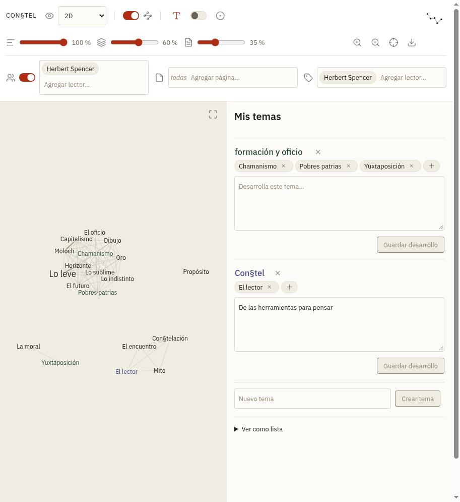
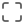
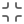
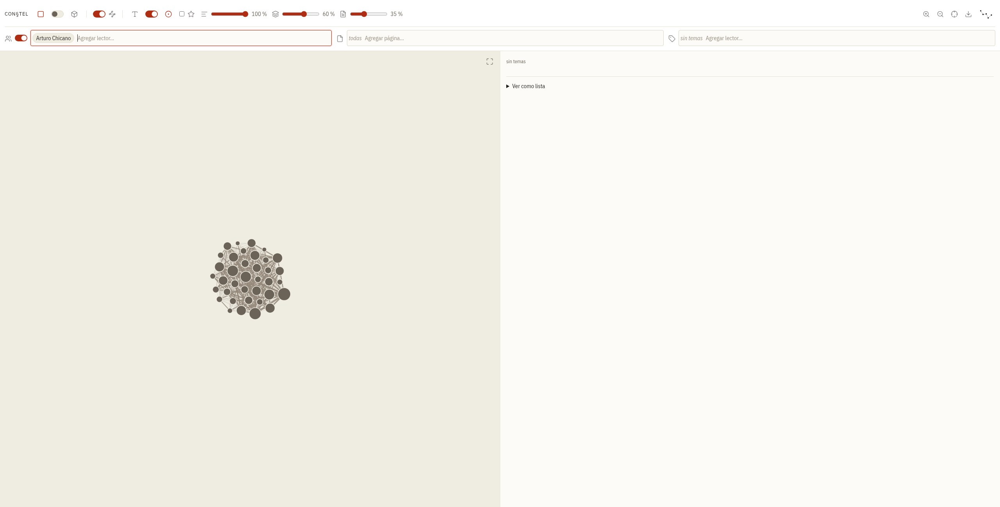
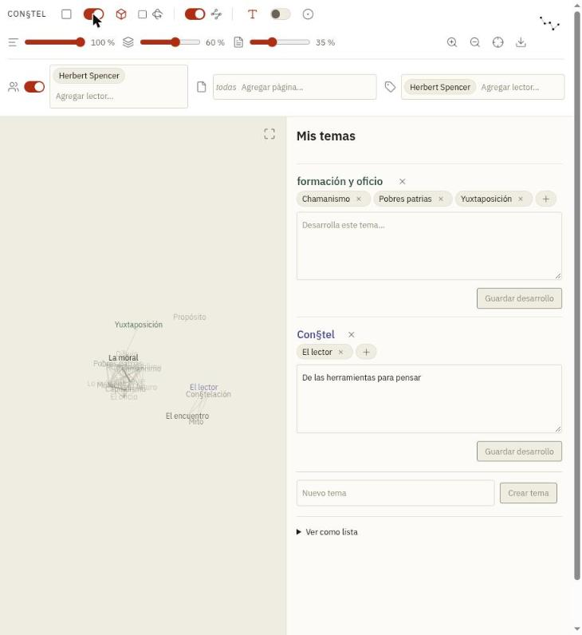
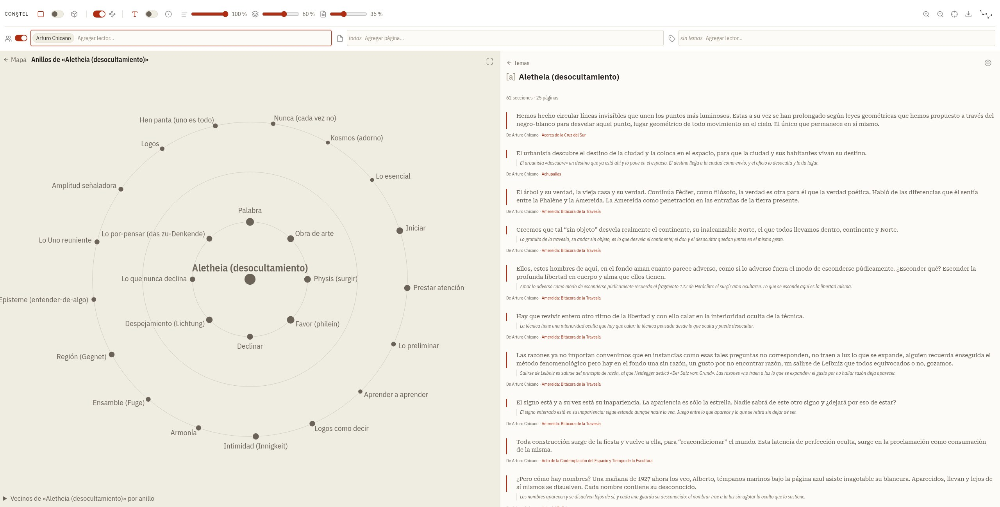
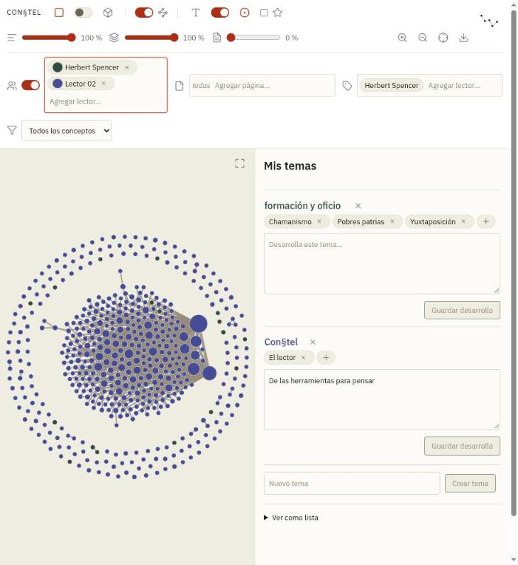

# El mapa de constelación

`Especial:Constelación` dibuja los conceptos ([a]) que los lectores anotaron como
un grafo: cada concepto es una palabra o un nodo, y cada relación entre dos
conceptos es una arista. Este manual explica **cómo se usa** (cada control, con
su ícono) y **cómo funciona por dentro** (qué se calcula, con qué parámetros y
dónde se ajusta).

El código está en `resources/ext.constel.map/`: `graph.js` (layout y dibujo),
`map.js` (barra, filtros y estado), `rings.js` (vista de anillos), `pills.js`
(píldoras con autocompletado) y `sidepanel.js` (panel de la derecha). Los datos
salen de `src/Map/GraphBuilder.php` y de la API `list=constelgraph`.

El spec (`specs/casiopea-constel.allium`, superficie `ConceptMap`) fija lo que el
mapa garantiza (por ejemplo `ProximityDegreesAreParametric`, `FrequencyScaling`,
`LabelsNeverOverlapIn2D`, `LabelsAreOptional`, `TextScaleIsConsistent`,
`MapHasLoadLimits`). Los números de este manual son decisiones de diseño y
pueden ajustarse.

**Contenido**

1. [Recorrido rápido](#1-recorrido-rápido)
2. [La barra, control por control](#2-la-barra-control-por-control)
3. [Conceptos: palabras y nodos](#3-conceptos-palabras-y-nodos)
4. [Aristas y proximidad](#4-aristas-y-proximidad)
5. [Cómo se calculan las posiciones](#5-cómo-se-calculan-las-posiciones)
6. [Vista de anillos](#6-vista-de-anillos)
7. [Varios lectores](#7-varios-lectores)
8. [Límites de carga](#8-límites-de-carga)
9. [Recalcular mientras se arrastra un control](#9-recalcular-mientras-se-arrastra-un-control)
10. [Teclado, toque y accesibilidad](#10-teclado-toque-y-accesibilidad)
11. [Preferencias guardadas y configuración](#11-preferencias-guardadas-y-configuración)
12. [Constantes](#12-constantes)
13. [Medición y decisiones descartadas](#13-medición-y-decisiones-descartadas)
14. [Íconos y licencia](#14-íconos-y-licencia)
15. [El mapa en cualquier página: `{{#constel:}}`](#15-el-mapa-en-cualquier-página-constel)

## 1. Recorrido rápido

La pantalla tiene tres zonas:

- **La barra de arriba** tiene dos filas. La primera dice **cómo se ve** el mapa
  (vista, aristas, palabras o nodos, proximidad, zoom). La segunda dice **qué se
  ve** (de qué lectores, de qué páginas, con qué lente de temas y, con varios
  lectores, qué conceptos).
- **El mapa** (a la izquierda) dibuja los conceptos. La vista por omisión es 2D
  con palabras, aristas visibles y todo encuadrado; lo que cada lector cambia
  (2D/3D, aristas, palabras o nodos, fuerzas) se recuerda por navegador. El tamaño de cada palabra sigue la frecuencia del concepto, y su
  color, el tema que lo agrupa.
- **El panel** (a la derecha) muestra los temas de la lente y, al elegir un
  concepto, todas sus secciones (§§), con su procedencia, sus temas y las
  acciones que permite el rol de quien mira. La división entre mapa y panel se
  arrastra.

Un clic sobre un concepto lo elige: el encuadre no se mueve (ni el zoom ni el desplazamiento: el mapa entero es el marco estable), su palabra pasa a negrita
y el panel muestra sus secciones. Un clic en el fondo del mapa no cambia la
selección, y arrastrar el fondo desplaza el mapa.

## 2. La barra, control por control

Cada ícono lleva un tooltip que explica qué hace su control (se ve al dejar el
puntero encima) y el mismo texto como nombre accesible. Las imágenes de los
íconos son [Lucide](https://lucide.dev); la tabla de la sección 14 lista todos.

### Fila 1: cómo se ve

| Ícono | Control | Qué hace | Por omisión |
|---|---|---|---|
|  ⇄  | **Vista plana (2D) ⇄ vista en el espacio (3D)**, un interruptor con un ícono a cada lado | 2D dibuja el mapa en un plano, donde los rótulos nunca se pisan y cada concepto se arrastra. 3D lo dibuja en una esfera que se orbita arrastrando, con niebla en profundidad. Cambiar de vista rehace el layout desde cero, porque 2D y 3D no comparten posiciones | 2D (después, la última elegida) |
|  | **Girar solo** (casilla, sólo en 3D) | El mapa 3D gira por sí mismo y se detiene al apuntarlo. Nunca gira con `prefers-reduced-motion` | apagado |
|  | **Mostrar aristas** (interruptor) | Dibuja u oculta las relaciones entre conceptos. Ocultas, la atracción entre conceptos se mantiene | encendido |
|  ⇄  | **Conceptos como palabras ⇄ como nodos**, un interruptor con un ícono a cada lado | Palabras dibuja cada concepto con su texto, en el color del texto, y el color de su tema va de fondo, en una caja del tamaño exacto del rótulo con un desenfoque de `2.25ex` (sólo los conceptos con tema; en 2D y en 3D; `?wash=0` en la URL la apaga; el SVG exportado conserva el texto de color sin fondo). Nodos lo dibuja como un círculo del color de su tema y de área según su frecuencia, y la palabra aparece al apuntarlo (sección 3) | palabras |
|  | **Proximidad: misma sección (§)** (deslizador 0 a 100 %) | Cuánto atrae a dos conceptos que titulan un mismo § y cuán visible es su arista | 25 % |
|  | **Proximidad: traslape** (deslizador) | Lo mismo para conceptos de secciones de lectores distintos que comparten texto | 25 % |
|  | **Proximidad: mismo texto** (deslizador) | Lo mismo para conceptos anotados en una misma página | 25 % |
|  | **Proximidad: tema** (deslizador) | Cuánto atrae a los conceptos de un mismo tema (mismo color) hacia el centro de su tema, como conjunto: los atrae entre sí, aleja a los de otros temas y debilita las aristas que cruzan temas. No dibuja aristas: sólo agrupa. Hacia 100 % los temas se separan en conjuntos de borde definido | 25 % |
|   | **Acercar y alejar** | Escalan el mapa por 1,25 (hasta 8 veces) y, con él, la letra, más lento (sección 3) | encuadre |
|  | **Encuadrar todo el mapa** | Vuelve al zoom y la posición de partida, centrado en todo el mapa | |
|  | **Volver al orden automático** (sólo en 2D, y sólo si hay conceptos movidos a mano) | Suelta los conceptos que se arrastraron y rehace el layout | |
|  | **Exportar el mapa como SVG** | Descarga el mapa tal como se ve (vista, filtros y zoom), con colores, tipografías y el halo de contraste de los textos ya resueltos | |
|  | **Copiar el código de incrustación** | Copia al portapapeles el `{{#constel: …}}` que reproduce el mapa tal como está: lectores, páginas, concepto elegido, 2D/3D, aristas, palabras o nodos y las fuerzas que difieren de las de partida (los temas no, porque la incrustación no los lleva). El ícono pasa un momento a un visto | |
|  /  | **Pantalla completa del mapa** (esquina del mapa) | Pone sólo el mapa a pantalla completa; Esc sale | |

Las tres fuerzas de proximidad (la cuarta, la de tema, no tiene aristas) se explican en la sección 4; al moverlas el mapa
reacomoda en vivo (sección 9). En 0 %, el grado no dibuja arista ni atrae.

### Fila 2: qué se ve

| Ícono | Control | Qué hace | Por omisión |
|---|---|---|---|
|  | **Secciones de** (píldoras con autocompletado) | Sólo los §§ de los lectores de la lista. Se nombran por su nombre real si lo definieron, si no por su usuario. «Todos» (con un ícono de globo  en la lista y en su píldora) es un lector más que quita el filtro: reemplaza a los demás, y agregar a cualquiera lo saca. Admite hasta 8 lectores | quien mira (para un visitante anónimo, «Todos») |
|  | **Páginas** (píldoras) | Sólo los §§ de esas páginas. Vacío es todas. `?page=Título` en la URL abre el mapa ya filtrado | todas |
|  | **Temas de** (lente, píldoras) | Colorea y agrupa los conceptos según los temas de esos lectores. Para una cuenta registrada nunca queda vacía. Sólo los temas propios se editan | quien mira |
|  | **Qué conceptos ver** (selector, sólo con varios lectores) | Todos, sólo los compartidos (con §§ de dos o más de los lectores filtrados) o sólo los propios (de uno solo) | todos |

Cada píldora tiene una  para quitarla. Con dos o más lectores, además, un
círculo de color que abre un selector de color (sección 7).

### El panel

| Ícono | Control | Qué hace |
|---|---|---|
| ← Temas | **Volver a los temas** | Texto con flecha (no botón): deja de mostrar el concepto elegido y vuelve a los temas de la lente |
|  | **Ver anillos** | El concepto al centro y sus vecinos en tres anillos (sección 6) |
|  | **Agregar** un concepto a un tema, o una sección a un concepto | |
|  | **Quitar** un concepto de un tema, o cerrar un aviso | |
|  | **Fusionar «X» con…** (bajo el mapa; sólo moderadores) | Junta el concepto con otro del vocabulario: sus secciones y agrupaciones pasan al que queda, tras una confirmación |

La división entre el mapa y el panel es un separador que se arrastra o se mueve con
las flechas del teclado (20 a 80 %; Inicio y Fin a los extremos; doble clic
vuelve a mitad y mitad). Cada navegador recuerda la proporción.

### Avisos y estado de carga

Mientras se leen los conceptos y se calculan las distancias, el lienzo lo dice al
centro con el texto «Leyendo conceptos y calculando distancias», que late
levemente (quieto con `prefers-reduced-motion`). Un cambio de vista sobre un mapa
de 150 conceptos o más lo muestra antes de calcular.

Cuando un tope de carga actúa (sección 8) un aviso flota sobre el mapa, sin
ocupar lugar en el diseño. Se cierra con su  y se apaga solo a los 12 segundos. Lo
cerrado o vencido no vuelve a salir mientras el texto sea el mismo.

## 3. Conceptos: palabras y nodos

### Como palabras

Cada concepto es su texto. El tamaño sigue la frecuencia (`FrequencyScaling`):

    frecuencia = 0,6 · §§ / máx§§  +  0,4 · páginas / máxpáginas     (0 a 1)
    tamaño al encuadre = 11 + 11 · frecuencia                          (11 a 22 px)

La letra tiene el **mismo criterio en 2D y en 3D** (`fontUnits`): al encuadre mide
`max(11, tamaño · fit · ppu)` px, o sea lo que reservaron las cajas, y el zoom la
multiplica por `(zoom / fit)^0,5`, con el resultado acotado entre **11 y 24 px**.
Acercar siempre agranda el texto, más lento que el mapa, y nunca baja de 11 px.
(Antes el 2D escalaba la letra con el zoom de encuadre, aplastada contra el piso en
mapas densos, y el 3D partía sin encuadre, así que salía más grande; y como la
letra crecía desde un tamaño natural bajo el piso, acercar no la cambiaba.)

El **concepto elegido** va en negrita, igual en 2D y en 3D, y nunca subrayado. El
que tiene el puntero o el foco resalta junto a sus vecinos, y el resto se atenúa.

### Como nodos

Cada concepto es un `<circle>` del color de su tema, con **área proporcional a su
frecuencia** (la misma del rótulo). En pantalla mide

    radio = DOT_MIN_PX · (1 + (DOT_MAX_PX / DOT_MIN_PX − 1) · √frecuencia)
          = de 2,4 a 10 px al encuadre

y crece al acercar como la letra (`(zoom / fit)^0,5`), sin pasar nunca de 10 px de radio (`DOT_MAX_PX`). El círculo es lo que se
apunta, recibe el foco y se arrastra; la palabra aparece encima al apuntarlo o
elegirlo.

- **Cajas de choque.** En 2D la caja de un círculo es un cuadrado de su radio más
  `PAD`, pero dos círculos chocan como círculos (distancia entre centros mayor o
  igual que la suma de radios más `2·PAD`, como entre dos cajas de texto). Reservan
  el mismo suelo que las letras: un círculo nunca baja de `DOT_MIN_PX` al encuadre.
  La escala del layout se ancla al ancho medio de las cajas, que con nodos es mucho
  menor, así que el mapa se compacta.
- **Densidad.** Con mapas muy densos los nodos resuelven la legibilidad que las
  palabras no pueden (sección 13).
- **Dónde se toca.** Con mouse o puntero, un clic elige el concepto. En un
  dispositivo que no puede apuntar sin tocar (`hover: none`: teléfono, tableta) el
  primer toque revela el concepto (palabra y aristas) y el segundo lo elige.

### Colores

El color de un concepto viene de su tema en la lente: hay 8 categorías de color
(`constel-graph__node--cat-0…7`), que siguen el orden de los temas de los lectores
de la lente. Un concepto sin tema usa la tinta suave, y los propios, la tinta
plena.
El color de cada tema se cambia con el círculo que lleva antes de su nombre en el
panel de temas (`themeColors`, sección 11). Con varios lectores el color indica quién lo aporta (sección 7).

## 4. Aristas y proximidad

### Los datos: nodos y aristas

`GraphBuilder` arma el grafo con los §§ visibles según los filtros (lectores y
páginas). Los §§ congelados (página borrada) no cuentan.

- **Nodo**: un concepto con al menos un §. Lleva su nombre, sus §§, sus páginas
  y, si quien mira aportó, una marca `mine`.
- **Aristas**, en tres grados de proximidad. Cada par de conceptos puede tener
  hasta tres, una por grado, y cada una tiene un **peso** entero:

| Grado | Clave | Cuándo | Peso |
|---|---|---|---|
| Misma sección | `co_excerpt` | los dos conceptos titulan el mismo § | nº de §§ que comparten |
| Traslape | `overlap` | §§ anclados de lectores distintos, en la misma página, cuyos rangos comparten al menos un carácter | nº de pares de §§ traslapados |
| Mismo texto | `co_page` | los dos conceptos aparecen en la misma página | nº de páginas compartidas |

El traslape es sólo una relación: nunca identifica ni fusiona conceptos
(`OverlapNeverConverges`). Las aristas se dibujan **debajo** de los nodos y las
palabras (capas: aristas, círculos, textos), de modo que no tapan nada.

### Los controles de fuerza

Hay uno por grado, de **0 a 100 %, en pasos de 5 %** (internamente `valor / 100`).
Todos parten al 25 % (el de tema también); lo que cada lector ajusta se recuerda.

| Control | Grado | Por omisión | Opacidad base de su arista |
|---|---|---|---|
|  misma sección | `co_excerpt` | 25 % | 0,85 |
|  traslape | `overlap` | 25 % | 0,60 |
|  mismo texto | `co_page` | 25 % | 0,40 |

Los valores expresan una jerarquía: la misma sección es una decisión explícita de
un lector; el traslape, un cruce entre lectores; el mismo texto, la relación más
débil. La fuerza elegida se recuerda por navegador. Cada control afecta a su grado
en cuatro cosas:

1. **Atracción en el layout**: multiplica el resorte de sus aristas.
2. **Visibilidad de la arista**: opacidad = `base · (0,4 + 0,6 · fuerza)`. A 100 %
   tiene su opacidad base y a 5 %, el 43 % de ella. El grosor depende del peso,
   no de la fuerza: `min(5, 1 + log₂(1 + peso))` px (las de `co_page`, 1 px).
3. **En 0 el grado desaparece**: sus aristas no se dibujan, no atraen y no se
   cargan. El cliente ni siquiera las pide al
   servidor hasta que la fuerza sube.
4. **Al arrastrar un concepto (2D)**: la simulación en vivo usa la misma fuerza
   para la rigidez de cada resorte.

### Cuántas aristas se dibujan

Se dibujan todas mientras quepan. Con más aristas que `ConstelMapMaxDrawnLinks`
(6 000) se dibujan **las más fuertes** (por fuerza del grado y `log₂(1 + peso)`)
hasta ese tope y, además, **todas las del concepto apuntado o elegido**. Las del
concepto enfocado se ven más tenues cuantas más sean (de opacidad 1 a 0,12), para
que un concepto muy conectado no inunde el mapa.

## 5. Cómo se calculan las posiciones

2D y 3D usan el **mismo layout de fuerzas** (`layout()`), del tipo
Fruchterman-Reingold, en tres coordenadas; en 2D la `z` vale 0. Con `n` conceptos
el espaciado ideal es

    k = 600 / √n        (unidades del layout)

y en cada iteración cada concepto acumula:

1. **Repulsión** con todos los demás: magnitud `k² / d` (d = distancia).
2. **Resorte** por cada arista activa, que atrae a sus dos extremos: magnitud
   `d² / k · log₂(1 + peso) · fuerza(grado)`.
3. **Gravedad** al centro: `−1,5 · posición` (`GRAVITY`). Mantiene el área del
   mapa del orden de `n · k²`.
4. **Atracción al centroide de su tema** (si pertenece a uno de la lente):
   `0,15 · (centroide − posición)`.

El paso de cada concepto se limita por una **temperatura** que empieza en `2k` y
baja un 3 % por iteración (300 iteraciones). Las posiciones iniciales son una
espiral de Fibonacci: el mismo mapa cae igual cada vez.

### Largo de una arista

Un solo resorte contra la repulsión de sus extremos queda en equilibrio donde
`d² / k · w · f = k² / d`, es decir

    d ≈ k · (w · f)^(−1/3)      con w = log₂(1 + peso), f = fuerza (0 a 1)

| Peso | f = 100 % | 60 % | 35 % | 5 % |
|---|---|---|---|---|
| 1 | 1,00 k | 1,19 k | 1,42 k | 2,71 k |
| 3 | 0,79 k | 0,94 k | 1,13 k | 2,15 k |
| 7 | 0,69 k | 0,82 k | 0,98 k | 1,88 k |

Es una aproximación: cada concepto siente además la repulsión de todos, la
gravedad, su tema y sus otras aristas. Pero dice lo esencial: **más peso, más
cerca; menos fuerza, más lejos**, y la fuerza actúa con raíz cúbica (bajar de 100 %
a 35 % alarga la arista unas 1,4 veces, no 3).

### 2D: distancias medidas en rótulos

En 2D la escala del layout no se normaliza: se ancla al tamaño de los rótulos. `k`
pasa a valer `EDGE_IN_LABELS = 1,3` veces el ancho medio de una caja (medido con la
tipografía real, más su margen `PAD`). Una arista de peso 1 con fuerza 100 % mide
del orden de 1,3 rótulos, y bajar una fuerza **abre** de verdad a sus conceptos
respecto de las letras.

Después vienen dos pasos que sólo existen en 2D:

1. **Choques** (`separate()`, que repite `collide()`): cada rótulo ocupa su caja de
   tinta más `PAD = 3` unidades por lado; los pares que se pisan se apartan por el
   eje de menor traslape (un par de círculos, por distancia entre centros). Si una
   zona densa no cede, el mapa entero se abre un 15 % y se reintenta, hasta que
   nada se toque (`LabelsNeverOverlapIn2D`).
2. **Encuadre** (`settle()`): el mapa se centra y el zoom inicial es el que lo
   encuadra (`min(1, 0,96·ancho/extensión, 0,96·alto/extensión)`). Si a ese zoom una
   letra quedaría bajo 11 px, su caja se reserva ya de ese tamaño antes de separar,
   así que a ese zoom o más nada se pisa.

Un concepto **arrastrado** (o movido con Alt y las flechas) sólo queda fuera de la
simulación mientras se sostiene: el resto reacciona en vivo (resortes con el largo
que tenían, cajas que chocan, cada concepto con una tendencia suave a su lugar de
partida). Al soltarlo vuelve a la simulación: no queda fijado, y el lugar donde se
soltó pasa a ser su nuevo equilibrio. Cambiar una fuerza rehace el layout desde las
posiciones de ahora.

### 3D: esfera, perspectiva y niebla

En 3D el layout termina **normalizado**: se lleva el centroide al origen y todo se
escala para que el percentil 92 de las distancias quede en el radio de la esfera,
no el máximo, de modo que un concepto lejano no apriete al resto contra el centro
(el que queda fuera se ve más lejos). Las distancias son entonces **relativas**: al
bajar una fuerza sus conceptos se abren respecto de los demás, pero el mapa no
crece, se redistribuye.

- **Radio.** `sphereRadius = RADIUS · √(n / 60)`, entre 1 y 3 veces `RADIUS = 210`:
  un mapa grande se abre en vez de amontonarse. El encuadre (`fit`) deja la esfera
  entera en el lienzo, como en 2D.
- **Perspectiva.** La cámara está a `CAMERA = 900`: cada punto se escala por
  `900 / (900 − z)` tras rotarlo (yaw y pitch). La letra sigue esa escala.
- **Niebla.** Cada concepto tiene una opacidad de 0,35 (lo más lejano) a 1 (lo más
  cercano), con curva lineal: lo del fondo se aclara lo justo para hacer de telón sin
  volverse ilegible. (Antes era de 0,08 y cuadrática, y atenuaba demasiado.) Los rótulos pueden cruzarse en 3D; la
  garantía de no traslape es sólo de 2D.
- **Órbita.** Arrastrar el fondo orbita (con Mayús o el botón del medio, desplaza);
  elegir un concepto no cambia el centro de la rotación.

## 6. Vista de anillos

Con un concepto elegido,  reemplaza el lienzo por su vista egocéntrica
(`rings.js`). Se vuelve con «← Mapa», que conserva la selección. Los tres anillos
son los tres grados de proximidad, del más fuerte al más débil: **misma sección**
(radio 115), **traslape** (215) y **mismo texto** (315), con cupos de 8, 16 y 24
vecinos (`RING_RADII`, `RING_QUOTAS`).

- **Anillos vacíos.** Bajo la barra, una leyenda numera los anillos de adentro hacia
  afuera con su nombre, y uno sin vecinos lo dice. El **traslape** lo forman
  conceptos de lectores *distintos* sobre un mismo texto, así que con un solo lector
  queda vacío por definición («2. Traslape: sin vecinos (pide lectores distintos)»);
  con varios lectores, o sin filtro, se llena.

- **Anillo de cada vecino.** El del grado más fuerte que lo une al concepto del
  centro; a igual grado, el de mayor peso.
- **Cupo.** Cada anillo muestra los vecinos de mayor peso hasta su cupo (8, 16 y
  24); a los demás se llega eligiendo otro centro. (La lista «Vecinos de «X» por
  anillo» con su «+N más» se retiró el 2026-10-06: el mapa no tiene scroll.)
- **Orden angular.** Seriación voraz: se parte del vecino de mayor peso y se agrega,
  cada vez, el más próximo al último (suma de `log₂(1 + peso)` de todos los grados
  entre ambos), así los vecinos próximos entre sí quedan contiguos. Cada anillo
  parte de un ángulo distinto para que los rótulos no queden alineados en radio.
- **Rótulos.** Todos visibles, fuera del círculo y sobre el radio (a la derecha o a
  la izquierda según el lado). Los círculos tienen el color del tema y el área según
  la frecuencia, como los nodos.
- **Cambiar de centro.** Elegir un vecino lo lleva al centro deslizando los
  círculos (450 ms; sin animación con `prefers-reduced-motion`) y actualiza el
  panel. Los datos vienen de una lectura aparte con los tres grados (`cgkinds`),
  cacheada en el servidor, independiente de las fuerzas.

## 7. Varios lectores

Con dos o más lectores en  Secciones de, el servidor agrega a cada
nodo `readers` (usuario → cantidad de §§, sólo de los lectores filtrados; los
ocultos para quien mira no se nombran, pero su aporte sigue contando en el total).
El cliente:

- **Pinta por lector.** El texto del concepto (o su círculo) se pinta con el color
  del lector que lo aporta. Si lo aportan varios, con un degradado de tramos
  parejos al borde, de largo proporcional al aporte de cada uno (un
  `linearGradient` por composición distinta). No hay subrayados ni anillos.
- **Elige el color.** Cada lector parte con el color de su lugar en el filtro (los
  colores de categoría de los temas). En su píldora hay un círculo de 1,15 rem que
  abre un selector de color (`input type="color"`) y hace de leyenda. La elección se
  recuerda por navegador (`readerColors`).
- **Filtra conceptos.** El selector  de la fila de filtros deja ver todos,
  sólo los compartidos (dos o más lectores aportan al concepto) o sólo los propios
  (uno solo). Se calcula en el cliente sobre `readers` y deja las aristas entre los
  que quedan; al subir una fuerza desde 0 con el mapa filtrado se piden los grados
  que faltan y se redibuja.
- **Parte con el traslape primero.** Sin fuerzas guardadas por quien mira, el mapa
  parte con traslape al 100 % y mismo texto en 0 % (`autoForces`), que es lo que une a
  lectores distintos. Con un solo lector vuelven las de siempre.
- **Lado a lado (fase posterior).** `graph.draw` no guarda estado fuera de su
  contenedor y `map.js` concentra el estado en un objeto, de modo que dos paneles
  con el mismo trazado se arman con dos llamadas; falta sincronizar posiciones y
  selección entre ambos.

## 8. Límites de carga

El mapa está pensado para lecturas colectivas muy grandes, así que cada costo tiene
un tope (`MapHasLoadLimits`), con un valor por omisión que se ajusta en la
configuración y un aviso cuando el tope actúa (sección 2).

| Qué | Tope (por omisión) | Qué pasa al pasarlo |
|---|---|---|
| Conceptos por respuesta | `ConstelMapMaxNodes` (2 000) | el servidor entrega los más frecuentes, con sus conteos completos, y calcula las aristas sólo entre ellos; el aviso dice «los N más frecuentes de M» |
| Palabras | `ConstelMapMaxLabels` (300) | como palabras, las 300 más frecuentes llevan su palabra y el resto son nodos |
| Aristas dibujadas | `ConstelMapMaxDrawnLinks` (6 000) | se dibujan las más fuertes hasta el tope y las del concepto apuntado o elegido; si al subir una fuerza se pasa del tope, el mapa se redibuja así |
| Lectores en el filtro | 8 (`MAX_READERS`, uno por color) | el campo se apaga («Máximo: 8») |

El trazado también está acotado. La repulsión del layout compara todos los
conceptos entre sí, así que sus iteraciones bajan cuando hay muchos
(`LAYOUT_BUDGET`, 3·10⁸ pares en total, con un mínimo de 60 iteraciones; hasta unos
1 000 conceptos siguen siendo 300) y la temperatura baja más rápido para llegar
igual al equilibrio. El choque de cajas (`collide`) ordena por borde izquierdo y sólo
compara las que se cruzan en x, no todas con todas.

En el servidor, el grafo se calcula una vez por conjunto de lectores, de páginas y
de grados pedidos, y se guarda en caché (`WANObjectCache`); cualquier escritura que
cambia lo que el mapa dibuja lo descarta (`GraphIsCached`). La respuesta viaja
empaquetada (`cgcompact`) y sólo con los grados con fuerza (`cgkinds`): con 20 000 §§
pasa de 6,9 MB a 0,8 MB. El detalle está en `docs/ARCHITECTURE.md`, sección «Mapa y
páginas especiales».

## 9. Recalcular mientras se arrastra un control

El mapa **sigue al control mientras se arrastra** (`input`), sin saltos:

- `map.js` pide a lo más **un recálculo por cuadro** (`requestAnimationFrame`), con
  el último valor; al soltar sólo se recuerda la preferencia y se actualiza la lista
  accesible.
- `graph.setForces()` rehace el layout **en tibio** sin redibujar el SVG: parte del
  equilibrio anterior (en 3D, el de antes de normalizar) con temperatura `0,2k`
  (`WARM_TEMPERATURE`) y 120 iteraciones (`WARM_STEPS`), en vez de `2k` y 300. Un
  cambio chico mueve poco el mapa, pero arrastrar hasta el final llega al mismo grado
  de apertura que el cálculo en frío.
- Los conceptos **se deslizan** a su lugar nuevo (un 25 % del camino por cuadro,
  `GLIDE`); si el mapa estaba encuadrado, el zoom sigue al encuadre nuevo; si no, se
  respeta el de quien mira. Elegir un concepto no mueve el encuadre. Con
  `prefers-reduced-motion`, llegan sin deslizarse.
- Las aristas de un grado que baja a 0 se retiran del lienzo y vuelven al subirlo,
  sin redibujar. Un grado que estaba en 0 desde la carga se pide al servidor la
  primera vez que sube (`addLinks` lo suma al mapa dibujado).

Medido con datos locales pequeños (18 conceptos, 63 aristas), barriendo cada fuerza de
100 % a 0 % en pasos de 5 %: el cambio típico entre dos pasos bajó de ~25 % del ancho
del lienzo (en frío) a ~3 a 7 % en 2D, y de ~7 % a ~0,5 a 1,5 % en 3D. Recalcular
cuesta ~2 ms por paso; un layout completo, del orden de 25 ms con 150 conceptos.

El mapa al que se llega arrastrando depende del camino, y al recargar la página el
layout se calcula en frío con las fuerzas guardadas, así que puede no ser idéntico (la
apertura relativa sí es la misma).

## 10. Teclado, toque y accesibilidad

| Acción | Mouse o trackpad | Teclado | Toque |
|---|---|---|---|
| Elegir un concepto | clic | Tab hasta el concepto, Intro o Espacio | un toque (dos en un dispositivo sin hover: el primero lo revela) |
| Desplazar el mapa (2D) | arrastrar el fondo; trackpad con dos dedos | flechas, con el foco en el mapa | arrastrar |
| Orbitar (3D) | arrastrar el fondo (con Mayús, desplaza) | flechas | arrastrar |
| Acercar y alejar | rueda (hacia el cursor), pellizco del trackpad | `+` `=` y `−` | pellizco |
| Encuadrar |  | `0` | |
| Mover un concepto (2D) | arrastrarlo | Alt y flechas, con el foco en el concepto | arrastrarlo |
| Dividir mapa y panel | arrastrar el separador | flechas (Mayús: paso grande), Inicio, Fin | arrastrar |

Incrustado en una página (sin pantalla completa), la rueda sigue siendo de la
página y sólo Ctrl + rueda acerca. Arrastrar nunca selecciona los rótulos como texto.

Accesibilidad:

- **Alternativa textual** (`AccessibleAlternative`): retirada el 2026-10-07 por decisión
  del usuario; «Ver como lista» ya no existe en ninguna vista. La vista de anillos nombra
  los anillos en su leyenda y cada vecino es un botón con nombre accesible.
- Cada concepto es un botón con nombre accesible («Concepto, N secciones, M páginas»)
  y foco visible. Los nodos llevan el mismo nombre.
- Todo ícono tiene un tooltip que explica qué hace su control y el mismo texto como
  nombre accesible. Los interruptores usan `role="switch"`.
- `prefers-reduced-motion` apaga el giro automático, el deslizamiento entre
  posiciones, el de los anillos y el latido del texto de carga.
- El mapa respeta el tema claro y oscuro de Stella Nova: todos los colores son tokens
  `--constel-*` sobre `--sn-*`.

## 11. Preferencias guardadas y configuración

### Por navegador (`mw.storage`, clave `constel-map`)

| Campo | Qué guarda | Por omisión |
|---|---|---|
| `forces` | fuerza de cada grado (0 a 1) | 1 / 0,6 / 0,35 (con varios lectores y sin valor guardado, 1 / 1 / 0) |
| `concepts` | `words` o `nodes` | `words` |
| `autorotate` | girar solo en 3D | `false` |
| `readerColors` | color elegido de cada lector (usuario → `#rrggbb`) | el de su lugar en el filtro |
| `themeColors` | color elegido de cada tema (id → `#rrggbb`), desde el círculo antes de su nombre en el panel de temas | el de su categoría |
| `ante` | proporción del mapa en la pantalla completa (20 a 80 %) | 50 |

La vista (2D o 3D), el modo de qué conceptos ver y los filtros de lectores y páginas
no se guardan: cada visita parte en 2D, con quien mira como lector y todas las
páginas.

### Configuración del sitio (`LocalSettings.php`)

| Variable | Por omisión | Qué fija |
|---|---|---|
| `$wgConstelMapMaxNodes` | 2000 | conceptos por respuesta del mapa (0 = sin tope) |
| `$wgConstelMapMaxLabels` | 300 | palabras que dibuja el mapa aun como palabras |
| `$wgConstelMapMaxDrawnLinks` | 6000 | aristas dibujadas a la vez |
| `$wgConstelGraphCache` | `null` | tipo de caché (clave de `$wgObjectCaches`, p. ej. `CACHE_DB`) para el grafo; `null` usa la caché principal |
| `$wgConstelOverlapMaxPerPage` | 0 | tope de §§ anclados por página en el cálculo del traslape (0 = sin tope) |
| `$wgRateLimits['constel-annotate']` | 60 por minuto por usuario, 30 por cuenta nueva | límite de las escrituras de anotar |

## 12. Constantes

| Constante | Valor | Dónde actúa |
|---|---|---|
| `k` | `600 / √n` | espaciado ideal del layout |
| `GRAVITY` | 1,5 | atracción al centro |
| atracción al tema | 0,15 | hacia el centroide del tema |
| `EDGE_IN_LABELS` | 1,3 | 2D: `k` en anchos medios de caja |
| `PAD` | 3 | 2D: margen de cada caja (rótulo o círculo) |
| `FONT_MIN_PX`, `FONT_MAX_PX` | 11, 24 | rango de la letra en pantalla |
| `FONT_GROWTH` | 0,5 | exponente con que el zoom escala la letra y los nodos |
| `DOT_MIN_PX`, `DOT_MAX_PX` | 2,4, 10 | radio de los nodos al encuadre |
| `RADIUS` | 210 | 3D: radio base de la esfera (crece con `√(n/60)`, hasta 3×) |
| `CAMERA` | 900 | 3D: distancia de la cámara |
| `DEPTH_FOG_MIN` | 0,35 | 3D: opacidad de lo más lejano |
| `FORCES` | 1 / 0,6 / 0,35 | fuerza por omisión de cada grado |
| `OPACITY` | 0,85 / 0,6 / 0,4 | opacidad base de cada grado |
| `WARM_TEMPERATURE` | 0,2 | temperatura inicial del recálculo en vivo (× k) |
| `WARM_STEPS` | 120 | iteraciones del recálculo en vivo |
| `GLIDE` | 0,25 | fracción del camino por cuadro al deslizarse |
| `LAYOUT_BUDGET`, `MIN_STEPS` | 3·10⁸, 60 | presupuesto de trabajo del layout |
| `MAX_READERS` | 8 | lectores en el filtro |
| `NOTICE_MS` | 12 000 | duración de un aviso sobre el mapa |
| `RING_RADII`, `RING_QUOTAS` | 115, 215, 315 · 8, 16, 24 | anillos: radio y cupo |

## 13. Medición y decisiones descartadas

**Densidad.** Con los 1 006 conceptos de la prueba de carga (20 000 §§ sembrados),
posiciones a zoom de encuadre, en unidades del lienzo:

| Conceptos como | Ancho × alto | Alto/ancho | Extensión (√área) |
|---|---|---|---|
| Palabras (todos los 1 006, sin tope de palabras) | 1 979 × 3 461 | 1,75 | 2 617 |
| Nodos | 1 014 × 854 | 0,84 | 931 |

Con todas las palabras, 703 de los 1 006 quedaban en columnas de cinco o más con la
misma `x` (57 columnas, la mayor de 42). Con 1 006 letras de 11 px como mínimo el mapa
no cabe en la pantalla, y cada pasada de `settle()` reserva cajas más grandes, así
que la densidad de fondo la resuelven mejor los nodos. Por eso existe el tope de
palabras (300) y el aviso.

**Hueco entre nodos.** Con choque de círculos como círculos, el hueco mediano entre
vecinos bajó de 3,4 a 2,5 px (percentil 90: de 4,1 a 2,8 px), igual a `2·PAD` como
entre dos cajas de texto.

**Tiempo.** Redibujar con los 1 006 conceptos al cambiar palabras o nodos: más de
15 s sin topes (todas las palabras y todas las aristas), entre 2,5 y 3,7 s con los
topes (layout 1,3 s, `settle` 0,8 s, DOM 0,1 s). El grafo completo de 20 000 §§ llega
en 252 ms sin caché y en unos 30 ms con ella.

**Choque por la línea de centros: descartado.** Se probó empujar cada par por la
línea que une sus centros, en vez de por el eje de menor traslape. Quitaba las
columnas (55 rótulos en columnas de cinco o más) pero abría el mapa en una franja
ancha y baja (6 373 × 551, alto/ancho 0,09): una caja de rótulo es seis veces más
ancha que alta, y un montón denso que se abre se ensancha en esa proporción. Estirar
en vertical antes del choque, o debilitar la gravedad vertical, no cambiaron la
proporción, e inclinar el empuje hacia la vertical hizo que `separate()` dejara de
converger. Se conserva el choque por el eje de menor traslape.

**Escalas anteriores.** Hasta la 0.10 la letra mínima era de 11 px y el 2D y el 3D
escalaban distinto (sección 3).

## 14. Íconos y licencia

Los íconos de la interfaz son [Lucide](https://lucide.dev) (licencia ISC, sucesor de
Feather), con el trazo (1,75) y los colores de token de Stella Nova. La extensión trae
la geometría de los que usa en `resources/ext.constel.ui/icons.js`, y este manual,
los SVG en `docs/icons/` (con su `LICENSE`).

| Ícono | Nombre en el código | Nombre en Lucide | Dónde se usa |
|---|---|---|---|
|  | `square` | `square` | vista plana (2D) |
|  | `box` | `box` | vista en el espacio (3D) |
|  | `rotate-3d` | `rotate-3d` | girar solo |
|  | `waypoints` | `waypoints` | aristas |
|  | `type` | `type` | conceptos como palabras |
|  | `circle-dot` | `circle-dot` | conceptos como nodos |
|  | `globe` | `globe` | «Todos» en el filtro de lectores (lista y píldora) |
|  | `section` | `section` | proximidad: misma sección |
|  | `layers` | `layers` | proximidad: traslape |
|  | `file-text` | `file-text` | proximidad: mismo texto |
|  | `book-type` | `book-type` | proximidad: tema |
|   | `zoom-in`, `zoom-out` | igual | acercar y alejar |
|  | `crosshair` | `crosshair` | encuadrar |
|  | `rotate-ccw` | `rotate-ccw` | volver al orden automático |
|  | `download` | `download` | exportar SVG |
|   | `copy`, `check` | igual | copiar código de incrustación |
|   | `maximize`, `minimize` | igual | pantalla completa |
|  | `users` | `users` | secciones de (lectores) |
|  | `file` | `file` | páginas |
|  | `tag` | `tag` | lente de temas |
|  | `filter` | `funnel` | qué conceptos ver |
|  | `disc-2` | `disc-2` | ver anillos |
|  | `git-merge` | `git-merge` | fusionar conceptos |
|   | `plus`, `x` | igual | agregar, quitar y cerrar |
|  | `arrow-left` | `arrow-left` | volver («← Temas», «← Mapa») |
|  | `eye` | `eye` | disponible (ya no se usa en la barra) |

## 15. El mapa en cualquier página: `{{#constel:}}`

La parser function `{{#constel: …}}` (también `{{#con§tel: …}}`) inserta el
mapa **limpio** —el lienzo y nada más— en una página cualquiera. Sin barra, sin
filtros, sin panel lateral, sin moderación.

| Parámetro | Valores | Por omisión |
|---|---|---|
| `usuario` | uno o varios lectores, separados por `;` | todos |
| `concepto` | concepto de foco: se resalta y se centra (si no existe en el mapa, se ignora) | ninguno |
| `modo` | `2d` o `3d` | `2d` |
| `girar` | `sí` o `no` (sólo en 3D) | `no` |
| `aristas` | `sí` o `no` | `sí` |
| `conceptos` | `palabras` o `nodos` | `palabras` |
| `paginas` | páginas separadas por `;` | todas |
| `alto` | alto del mapa: `px`, `em`, `rem`, `vh`, `dvh` o `%` | `480px` |
| `fuerza-seccion`, `fuerza-traslape`, `fuerza-pagina`, `fuerza-tema` | 0 a 100 | 25 (con varios usuarios: traslape 100, mismo texto 0) |
| `class` | clases CSS que se suman al contenedor (p. ej. `full-width` o su sinónimo `ancho-completo`, que en Stella Nova lo lleva a sangre y sin esquinas redondeadas) | ninguna |

**Cómo funciona.**

- `src/Hooks/ParserHooks.php` (hook `ParserFirstCallInit`) sanea los
  parámetros y emite un `
` con
  ellos en JSON, y carga el módulo `ext.constel.embed`. Los nombres de la
  función están en `casiopea-constel.magic.php` (`constel`, `con§tel`).
- `resources/ext.constel.embed/embed.js` pide el grafo a la API
  (`list=constelgraph`, sólo los grados con fuerza) y lo dibuja con el mismo
  `graph.draw` del mapa completo (`fill: true`). Reusa `ext.constel.map`; no
  tiene estado compartido, así que cada mapa es independiente.
- La vista sale **sólo** de los parámetros. No lee ni guarda `constel-map` en
  `mw.storage`, y la salida no depende de quién mira: el parser cache la
  conserva igual para todos.
- Es de sólo lectura. Un clic en un concepto lo selecciona (resalta sus
  vecinos); no abre el panel, no anota ni modera. Sin temas (`themeOf` vacío),
  los conceptos no llevan color de tema.
- Los topes de carga son los de fábrica de `graph.js` (`MAX_LABELS`,
  `MAX_LINKS`), no los de `$wgConstelMapMaxLabels` / `$wgConstelMapMaxDrawnLinks`.
- **Panel de referencias.** Al elegir un concepto sale un panel flotante
  (`refpanel.js`) con sus páginas, los textos de sus §§ y los demás conceptos de
  cada §, unidos por líneas de árbol. Un concepto del panel lleva a `Especial:Constelación?concept=Nombre`:
  el mapa completo con ese concepto elegido (sin mover el encuadre: el centro
  es siempre el de la escena completa), y sus secciones en todos los textos (el
  filtro de lectores queda en «Todos»). A pantalla completa en
  `Especial:Constelación` no navega: elige el concepto en el mismo mapa. El parámetro `?concept=` sirve también como enlace.
- Sin JavaScript queda un texto que lo explica (`constel-embed-nojs`).
- **Esquinas.** El lienzo es redondeado como el del mapa completo. En
  Stella Nova, `class=full-width` (o `ancho-completo`) lo lleva a sangre y le
  quita borde y esquinas redondeadas (`resources/stella-nova.css`).

El manual para lectores vive en la wiki: página «Manual de con§tel».
